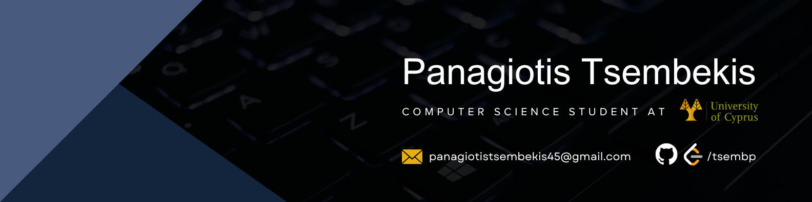

  
<h3 align="center">Passionate and goal-driven Computer Science student</h3>

---

## 🙋🏻‍♂️ About Me
I'm a second-year Computer Science student at the University of Cyprus, passionate about software engineering, cybersecurity and AI.

## 🚀 What I'm Up to
- 📚 Focusing on **Theory of Computation**, **Operating Systems**, and **Algorithms and Complexity** to deepen my expertise.
- 💻 Currently developing a **Student Grading System**, which you can find [here](https://github.com/tsembp/Student-Grading-System).

## 💻 Tech Stack:
### Languages:

### Developer Tools:

## 🌐 Connect with me:

